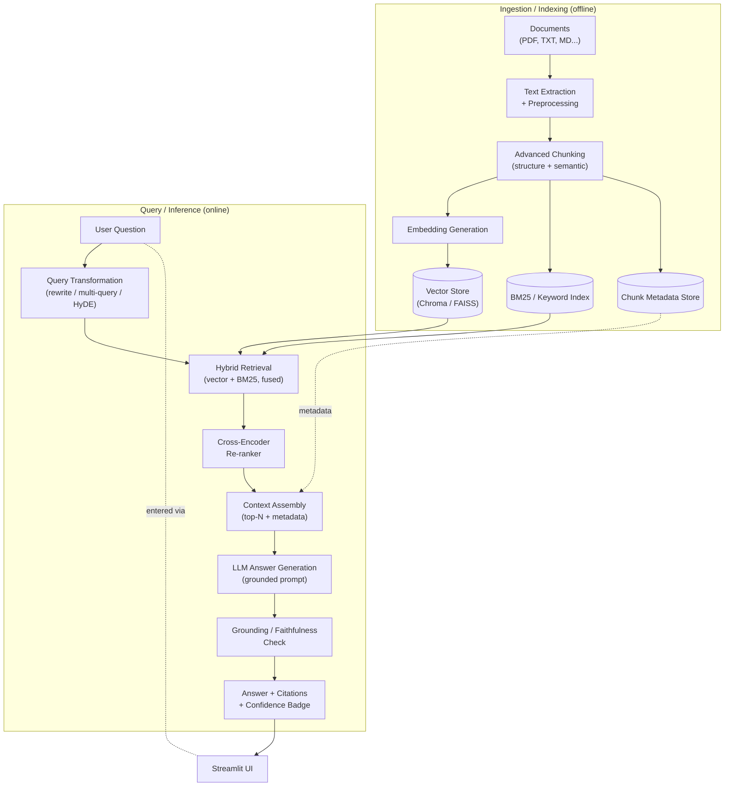
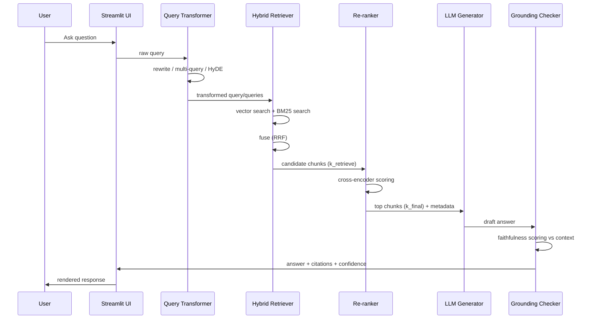

# Lunorsoft AI Developer — Round 1

## Mini AI Knowledge Assistant (RAG) — Design & Architecture Document

> Companion to `requirements.md`. This document details **how** the system is
> built, covering every core requirement, the differentiation features, and all
> bonus / future-scope items.

---

## Table of Contents

1. [Purpose & Scope](#1-purpose--scope)
2. [Design Goals & Principles](#2-design-goals--principles)
3. [High-Level Architecture](#3-high-level-architecture)
4. [Pipeline 1 — Ingestion / Indexing](#4-pipeline-1--ingestion--indexing)
5. [Pipeline 2 — Query / Inference](#5-pipeline-2--query--inference)
6. [End-to-End Data Flow](#6-end-to-end-data-flow)
7. [Data Models & Schemas](#7-data-models--schemas)
8. [Technology Stack & Justifications](#8-technology-stack--justifications)
9. [Project / Module Structure](#9-project--module-structure)
10. [Configuration & Environment](#10-configuration--environment)
11. [User Interface Design](#11-user-interface-design)
12. [Bonus Features — Design](#12-bonus-features--design)
13. [Future Scope — Evaluation Harness](#13-future-scope--evaluation-harness)
14. [Error Handling & Edge Cases](#14-error-handling--edge-cases)
15. [Design Decisions & Trade-offs](#15-design-decisions--trade-offs)
16. [Requirements Traceability Matrix](#16-requirements-traceability-matrix)

---

## 1. Purpose & Scope

The system is an **AI-powered knowledge assistant** that answers user questions
grounded in a supplied set of documents (PDFs and similar). It goes beyond a
naive RAG baseline by adding advanced chunking, hybrid retrieval, re-ranking,
query transformation, and a grounding/faithfulness check.

**In scope:** document ingestion, indexing, retrieval, answer generation,
grounding verification, citations, multi-document support, and a usable UI.

**Bonus (in scope if time allows):** conversation history, deployment.

**Future scope:** a formal evaluation harness (RAGAS-style metrics).

---

## 2. Design Goals & Principles

| Principle | Implication for the design |
| --- | --- |
| **Grounded over fluent** | Prefer answers provably supported by sources; flag when they aren't. |
| **Modular pipeline** | Each stage (chunk, embed, retrieve, rerank, generate, verify) is an independently swappable component behind a clear interface. |
| **Configuration-driven** | Model names, chunk sizes, `k` values, weights live in config, not hard-coded, so behavior can be tuned without code changes. |
| **Explainable retrieval** | Every answer traces back to specific chunks (doc + page + section) for citations and Round-2 defensibility. |
| **Fail safe, not silent** | Missing context, empty retrieval, or low grounding produces an honest "I don't know / low confidence" rather than a hallucination. |

---

## 3. High-Level Architecture

The system splits into two pipelines: an **offline ingestion pipeline** that
builds the indexes, and an **online query pipeline** that serves answers.



---

## 4. Pipeline 1 — Ingestion / Indexing

Runs when documents are uploaded/added. Produces three persisted artifacts:
the vector index, the keyword (BM25) index, and the chunk metadata store.

### 4.1 Document Loader

- **Responsibility:** accept one or more documents; support **multiple
  documents** (bonus) from the start by tagging each chunk with a `doc_id`.
- **Inputs:** PDF (primary), with easy extension to TXT/MD/DOCX.
- **Design note:** loader returns a normalized `RawDocument` object regardless
  of source format, so downstream stages are format-agnostic.

### 4.2 Text Extraction & Preprocessing

- **Extraction:** `pdfplumber` (better layout/heading fidelity) with `PyPDF` as
  a fallback for problem files.
- **Preprocessing:** whitespace normalization, de-hyphenation of line-broken
  words, removal of repeated headers/footers, and **page-number capture** (kept
  as metadata for citations).
- **Structure capture:** detect section/heading boundaries (font-size / regex
  heuristics) so the chunker can respect document structure.

### 4.3 Advanced Chunking *(Differentiation Feature E)*

Two-stage strategy, deliberately not fixed-size:

1. **Structure-aware split** — first split on detected headers/sections so a
   chunk never straddles unrelated sections.
2. **Semantic split within sections** — within each section, use a semantic
   splitter (embedding-similarity boundaries, e.g. LangChain
   `SemanticChunker`) so chunk boundaries fall at topic shifts, not arbitrary
   character counts.
3. **Guardrails** — enforce min/max token bounds and a small **overlap** between
   adjacent chunks to preserve context continuity.

Each emitted chunk carries full metadata (see [§7](#7-data-models--schemas)).

### 4.4 Embedding Generation

- **Model:** configurable — OpenAI `text-embedding-3-small` (default) /
  Gemini / HuggingFace `sentence-transformers` (offline fallback).
- **Batching:** embeddings generated in batches with retry/backoff on API
  errors.

### 4.5 Vector Store

- **Store:** **Chroma** (local, zero-infra, persists to disk) as default;
  FAISS supported as an alternative.
- **Contents:** embedding vector + `chunk_id` + metadata payload.

### 4.6 Keyword (BM25) Index *(supports Differentiation Feature A)*

- Built in parallel over the same chunk set using `rank_bm25` (or LangChain
  `BM25Retriever`).
- Enables exact-term matches (names, error codes, API names) that dense vectors
  routinely miss.

---

## 5. Pipeline 2 — Query / Inference

### 5.1 Query Transformation *(Differentiation Feature C)*

Improves recall for vague or poorly phrased questions. Configurable modes:

- **Rewrite:** LLM normalizes/clarifies the raw query.
- **Multi-query:** LLM generates 2–3 paraphrases; retrieval runs for each and
  results are pooled (de-duplicated).
- **HyDE (optional):** LLM drafts a hypothetical answer; that text is embedded
  and used for the dense search, often improving semantic match.

### 5.2 Hybrid Retrieval *(Differentiation Feature A)*

- Runs **dense (vector)** and **sparse (BM25)** retrieval in parallel.
- **Fusion:** Reciprocal Rank Fusion (RRF) or weighted score fusion (weights in
  config). RRF is default — it's robust and needs no score normalization.
- Output: a fused candidate set of size `k_retrieve` (e.g. 20).

### 5.3 Re-ranking *(Differentiation Feature B)*

- A **cross-encoder** reranker (`sentence-transformers`
  `ms-marco-MiniLM-L-6-v2`, or Cohere Rerank if API available) scores each
  candidate against the query jointly.
- Keeps the top `k_final` (e.g. 4–6) highest-precision chunks. This is the
  single biggest precision win over naive top-k vector search.

### 5.4 Context Assembly

- Concatenates the reranked chunks with lightweight source tags (doc name, page,
  section) so the LLM can cite, and so we can render citations.
- Enforces a context-token budget; drops lowest-ranked chunks if over budget.

### 5.5 Answer Generation

- **LLM:** configurable (OpenAI GPT / Gemini).
- **Prompt design:** instructs the model to answer **only** from the provided
  context, to cite sources inline, and to say it cannot find the answer when the
  context is insufficient (directly serving core requirement #8).

### 5.6 Grounding / Faithfulness Check *(Differentiation Feature D)*

Post-generation verification before the answer reaches the user:

- **Method:** LLM-as-judge that checks whether each claim in the answer is
  supported by the retrieved context, returning a **faithfulness score** and a
  supported/unsupported verdict. A cheaper overlap heuristic is available as a
  fallback.
- **Action on low score:** surface a warning badge, and optionally regenerate
  with a stricter prompt or downgrade to "I couldn't find enough support in the
  documents for a confident answer."
- **UI outcome:** a **confidence/faithfulness indicator** shown next to every
  answer.

### 5.7 Citation & Confidence Surfacing *(Bonus: Source Citations)*

- Each answer displays the source chunks it drew from (filename · page ·
  section), expandable to show the exact supporting snippet.
- The grounding score renders as a colored confidence badge (e.g.
  green/amber/red).

---

## 6. End-to-End Data Flow



---

## 7. Data Models & Schemas

### 7.1 Chunk object

```jsonc
{
  "chunk_id":      "doc3_p12_s2_004",   // stable unique id
  "doc_id":        "doc3",
  "source_file":   "operating-systems.pdf",
  "page_number":   12,
  "section_header":"3.2 Scheduling",
  "chunk_text":    "…",
  "char_start":    10432,
  "char_end":      11190,
  "token_count":   180
  // embedding vector stored in the vector index, keyed by chunk_id
}
```

### 7.2 Retrieval result

```jsonc
{
  "chunk_id": "doc3_p12_s2_004",
  "dense_score": 0.81,
  "bm25_score": 6.42,
  "fused_score": 0.030,   // RRF
  "rerank_score": 0.94    // populated after re-ranking
}
```

### 7.3 Answer envelope (returned to UI)

```jsonc
{
  "answer": "…",
  "citations": [
    {"source_file":"os.pdf","page":12,"section":"3.2 Scheduling","snippet":"…"}
  ],
  "faithfulness_score": 0.92,
  "confidence": "high",
  "used_query_transform": "multi-query",
  "retrieved_k": 20,
  "final_k": 5
}
```

---

## 8. Technology Stack & Justifications

| Layer | Choice (default) | Why |
| --- | --- | --- |
| Language | Python | Ecosystem for RAG tooling. |
| Orchestration | LangChain | Built-in `EnsembleRetriever`, `SemanticChunker`, retriever/LLM abstractions reduce glue code. |
| Extraction | pdfplumber (+ PyPDF fallback) | Better heading/layout fidelity for structure-aware chunking. |
| Chunking | Structure-aware + `SemanticChunker` | Coherent, topic-aligned chunks. |
| **Embeddings** | **Gemini embeddings (deployed) / local `all-MiniLM-L6-v2` (offline)** | Gemini has a no-credit-card free tier and runs off-server (memory-safe for deployment); local MiniLM is fully free for offline/demo runs. See §8.1. |
| Vector store | Chroma (FAISS alt.) | Local, persistent, zero infrastructure. |
| Keyword index | `rank_bm25` / `BM25Retriever` | Sparse retrieval for exact-term matches. |
| Fusion | Reciprocal Rank Fusion | Robust, normalization-free. |
| Re-ranker | Cross-encoder `ms-marco-MiniLM` (local) | Large precision gain on final context; small enough for the free deploy tier. |
| **LLM** | **Groq free tier (Llama 3.x / GPT-OSS)** | Fast, generous free tier; ideal for generation. Note: Groq has **no** embeddings API, so embeddings come from Gemini/local. See §8.1. |
| Grounding | LLM-as-judge via Groq (+ overlap fallback) | Enforces requirement #8; reuses the Groq LLM. |
| UI | Streamlit | Fastest path to a usable interface. |
| Deployment (bonus) | Streamlit Community Cloud (HF Spaces fallback) | Free, quick public link; both support Python/Streamlit servers. **Netlify is not suitable** — it hosts static sites / JS functions, not long-running Python. |

### 8.1 Provider Strategy (chosen free-tier stack)

The pipeline is **provider-agnostic behind a config switch**, but the chosen
default stack is built to be **fully free-tier and deployment-safe**:

- **LLM → Groq (free tier).** Fast, generous free inference for generation and
  the grounding-check judge. **Constraint discovered during design:** Groq's
  API is **chat/LLM-only — it has no embeddings endpoint.** So embeddings must
  come from elsewhere; this is the standard, documented pattern for Groq RAG.

- **Embeddings → two supported paths:**
  1. **Gemini embeddings (default for the deployed app).** Google's free tier
     needs no credit card. Because embedding runs on Google's servers, it adds
     almost **no memory cost** to the Streamlit container — important given the
     free tier's ~1 GB RAM ceiling. *Caveat:* on the unpaid tier, submitted
     content may be used to improve Google's products — acceptable here since
     the knowledge source is public assignment documents.
  2. **Local `all-MiniLM-L6-v2` (default for offline / local demo).** Fully
     free, ~90 MB, runs on CPU. Best for the Round-2 screen recording where the
     machine has full RAM. Larger local models (BGE/E5-large) are avoided as
     they risk OOM on the deploy tier.

- **Reranker → local cross-encoder (`ms-marco-MiniLM`).** Small enough to
  co-reside on the deploy tier alongside Gemini embeddings (which are remote),
  keeping the memory budget balanced.

> **Note on rate limits:** Gemini's exact free-tier RPM/RPD/TPM are
> project-specific and change over time; Google directs users to AI Studio for
> live values. For this assignment the volume is trivial — documents are
> embedded once at ingestion, and only short queries are embedded at runtime —
> so the free tier is comfortably sufficient. Use exponential backoff on 429s.

**Recommended split:** local MiniLM embeddings for the offline/demo run, Gemini
embeddings for the deployed link — same codebase, one config flag. This reads
as deliberate engineering (memory-aware deployment) rather than a compromise,
and is worth calling out in the README.

---

## 9. Project / Module Structure

```md
lunorsoft-rag-assistant/
├── app.py                     # Streamlit entry point (UI)
├── requirements.txt           # Python package dependencies
├── .env.example               # API keys template (no secrets committed)
├── README.md
├── DESIGN.md                  # this document
├── config/
│   └── settings.py            # models, chunk sizes, k-values, weights
├── src/
│   ├── ingest/
│   │   ├── loader.py          # document loading (multi-doc)
│   │   ├── extract.py         # pdfplumber extraction + preprocessing
│   │   └── chunker.py         # advanced (structure + semantic) chunking
│   ├── index/
│   │   ├── embeddings.py      # embedding generation
│   │   ├── vector_store.py    # Chroma/FAISS wrapper
│   │   └── keyword_index.py   # BM25 index
│   ├── query/
│   │   ├── transform.py       # rewrite / multi-query / HyDE
│   │   ├── hybrid_retriever.py# dense + sparse + fusion
│   │   ├── reranker.py        # cross-encoder re-ranking
│   │   └── pipeline.py        # orchestrates the full query flow
│   ├── generate/
│   │   ├── generator.py       # grounded LLM answer generation
│   │   └── grounding.py       # faithfulness check
│   └── models/
│       └── schemas.py         # Chunk / RetrievalResult / AnswerEnvelope
├── data/                      # sample source documents
├── storage/                   # persisted Chroma + BM25 + metadata
└── eval/                      # (future) RAGAS harness
```

---

## 10. Configuration & Environment

- **Secrets:** API keys (`GROQ_API_KEY`, `GEMINI_API_KEY`) via environment
  variables / `.env` (never committed); `.env.example` documents required keys.
- **Tunables in `config/settings.py`:** embedding provider/model, LLM model,
  chunk size/overlap, `k_retrieve`, `k_final`, fusion weights, query-transform
  mode, grounding threshold, confidence band cutoffs.
- **Provider switch:** a single flag chooses the embedding path
  (`gemini` vs local `minilm`) and keeps the LLM on Groq, so the project runs
  **fully on free tiers** — local embeddings for offline work, Gemini
  embeddings for the memory-constrained deployed app.

---

## 11. User Interface Design

**Streamlit single-page app** with:

- **Document panel:** upload one or more files; shows indexed docs and a
  "rebuild index" action.
- **Chat/query panel:** question input, answer display, **citations expander**,
  and a **confidence badge** driven by the grounding score.
- **Settings sidebar (optional):** toggle query-transform mode, `k` values,
  provider — useful for the Round-2 live demo.
- **Transparency touches:** show which query-transform ran and how many chunks
  were retrieved/used, reinforcing explainability.

---

## 12. Bonus Features — Design

### 12.1 Source Citations ✅ (built into core flow)

Covered in [§5.7](#57-citation--confidence-surfacing-bonus-source-citations):
metadata-tagged chunks → inline citations + expandable snippets.

### 12.2 Multiple Documents ✅ (built in from the start)

Every chunk carries `doc_id`/`source_file`; indexes are multi-doc; citations
disambiguate across files. No special-casing needed at query time.

### 12.3 Conversation History 🕒 (stretch)

- **Design:** maintain a short rolling message history in session state; before
  retrieval, run a **history-aware query rewrite** (condense the follow-up +
  prior turns into a standalone question) so retrieval stays accurate across
  turns.
- **Isolation:** history influences query rewriting only — retrieval still
  grounds on documents, preserving faithfulness.

### 12.4 Deployment 🕒 (stretch)

- **Target:** **Streamlit Community Cloud** for a public link; **Hugging Face
  Spaces (Streamlit template)** as the fallback. Both run real Python/Streamlit
  servers.
- **Not Netlify:** Netlify hosts static sites and short-lived JS serverless
  functions, not a long-running Python process with an open WebSocket — so a
  Streamlit app can't run there. (Netlify would only fit a static or
  React/Next.js frontend.)
- **Memory-aware provider choice:** the free tier is RAM-limited (~1 GB), so the
  deployed build uses **Gemini embeddings** (remote, low local memory) with the
  **local cross-encoder reranker**, rather than loading a local embedding model
  *and* a reranker together. See §8.1.
- **Design considerations:** secrets (`GROQ_API_KEY`, `GEMINI_API_KEY`) via the
  platform secret store, never committed; persisted `storage/` rebuilt on cold
  start or shipped with a small prebuilt sample index; **the run-locally path is
  the guaranteed fallback** if hosting misbehaves near the deadline; test the
  live link in an incognito window before submitting (brief requirement).

---

## 13. Future Scope — Evaluation Harness

Deferred until the core pipeline is stable, but designed for:

- **Framework:** RAGAS (or a lightweight custom harness).
- **Metrics:**
  - *Faithfulness* — is the answer supported by retrieved context?
  - *Answer relevance* — does the answer address the question?
  - *Context precision / recall* — did retrieval surface the right chunks?
- **Method:** a small curated Q/A set over the sample documents; run the same
  questions through **naive baseline vs full pipeline** and tabulate deltas.
- **Payoff:** produces the quantitative "before/after" evidence for the README
  and Round-2 defense. The pipeline's modularity (swappable retriever/chunker)
  makes ablation straightforward.

---

## 14. Error Handling & Edge Cases

| Case | Handling |
| --- | --- |
| Empty / failed retrieval | Return honest "no relevant information found"; never fabricate. |
| Low grounding score | Downgrade confidence badge; optionally refuse or regenerate stricter. |
| Corrupt/unreadable PDF | Skip with a surfaced warning; continue with remaining docs. |
| Embedding/LLM API failure | Retry with backoff; surface a clear error, no silent failure. |
| Oversized context | Trim to token budget by rerank order. |
| Duplicate chunks (multi-query pooling) | De-duplicate by `chunk_id` before rerank. |
| No documents indexed yet | UI blocks querying and prompts to upload first. |

---

## 15. Design Decisions & Trade-offs

**Why this beats naive RAG — mapped to concrete failure modes:**

| Naive RAG failure mode | This design's remedy |
| --- | --- |
| Misses exact keyword/entity matches | **Hybrid search** (BM25 + vector) |
| Top-k vector hits are noisy/low-precision | **Cross-encoder re-ranking** |
| Vague/ambiguous queries retrieve poorly | **Query transformation** (rewrite/multi-query/HyDE) |
| Model hallucinates beyond the sources | **Grounding/faithfulness check** + strict prompt |
| Fixed-size chunks fragment meaning | **Structure-aware + semantic chunking** |
| Answers can't be traced/trusted | **Citations + confidence badge** |

**Explicit trade-offs:**

- **Latency vs quality:** query transformation, hybrid retrieval, reranking, and
  grounding each add LLM/compute calls. Accepted deliberately — this is a
  quality-first assistant, and `k`/modes are configurable to tune the balance.
- **Local vs API models:** default to hosted models for quality, but keep an HF
  local path so the project can run without paid keys.
- **Chroma vs FAISS/Pinecone:** Chroma chosen for zero-infra local persistence;
  hosted stores add ops overhead not justified at this scope.
- **RRF vs weighted fusion:** RRF default for robustness (no score
  normalization); weighted fusion available for tuning.

---

## 16. Requirements Traceability Matrix

| Requirement (from `requirements.md`) | Where addressed |
| --- | --- |
| Core #1 knowledge source | §4.1 Loader (multi-doc) |
| Core #2 extract/process | §4.2 Extraction |
| Core #3 chunking | §4.3 Advanced chunking |
| Core #4 embeddings | §4.4 Embedding generation |
| Core #5 store & retrieve | §4.5 Vector store, §5.2 Hybrid retrieval |
| Core #6 accept questions | §11 UI |
| Core #7 retrieve + LLM answer | §5.4–5.5 |
| Core #8 grounded answers | §5.5 prompt + §5.6 grounding check |
| Core #9 usable interface | §11 UI |
| Diff. A Hybrid search | §4.6, §5.2 |
| Diff. B Re-ranking | §5.3 |
| Diff. C Query transformation | §5.1 |
| Diff. D Grounding/faithfulness | §5.6 |
| Diff. E Advanced chunking | §4.3 |
| Bonus Source citations | §5.7, §12.1 |
| Bonus Multiple documents | §4.1, §12.2 |
| Bonus Improved retrieval/eval | §5.1–5.3, §13 |
| Bonus Conversation history | §12.3 |
| Bonus Deployment | §12.4 |
| Future Eval harness | §13 |

---

*End of design document.*
